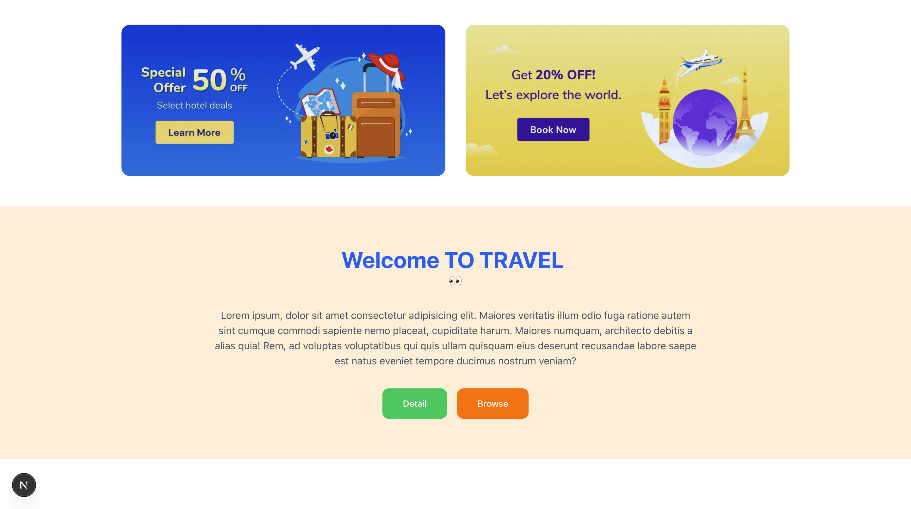
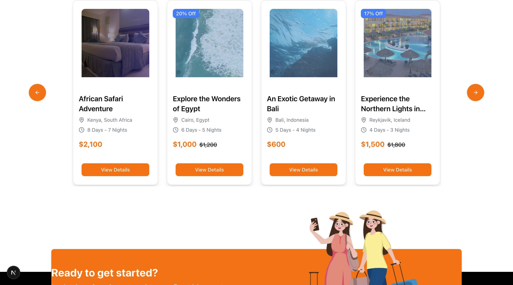
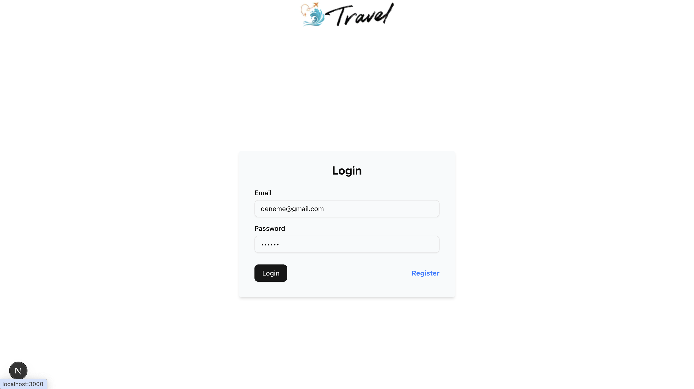
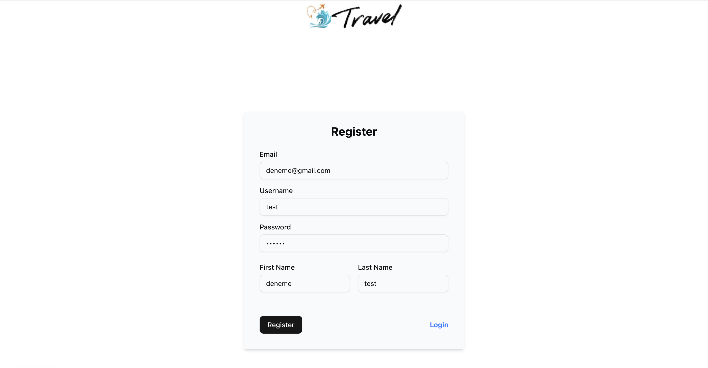

🌍 Travel Booking Website
A modern travel booking web application built with Next.js, MongoDB, NextAuth, Prisma, and TailwindCSS.
This project demonstrates authentication, database integration, and responsive UI — perfect for showcasing in a portfolio.

✨ Features
🔐 User Authentication with NextAuth (JWT strategy)
🗄️ MongoDB + Prisma for database management
🎨 Modern UI with TailwindCSS + Shadcn/ui components
⚡ State Management using Zustand
📋 Forms & Validation with React Hook Form + Zod
📱 Responsive Design optimized for all devices
🚀 API Endpoints powered by Next.js
🛠️ Tech Stack
TypeScript – Type safety
Next.js – React framework
MongoDB – NoSQL Database
Prisma – ORM for database queries
NextAuth – Authentication
TailwindCSS – Styling
Shadcn/ui – Accessible UI components
Zustand – State management
React Hook Form – Form handling
Zod – Schema validation
🚀 Getting Started
1️⃣ Clone the repo
git clone https://github.com/yourusername/travel-booking.git
cd travel-booking

2️⃣ Install dependencies

npm install

3️⃣ Set up environment variables

Create a .env file in the root directory:

DATABASE_URL="your-mongodb-uri"
NEXTAUTH_SECRET="your-secret-key"
NEXTAUTH_URL="http://localhost:3000"

4️⃣ Run the app
npm run dev

📸 Screenshots

🖥️ Home Page

🔐 Login Page

🔐 Register Page

🏨 Hotels Page

